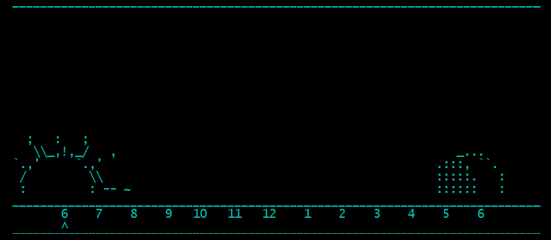

# Ascii art time dial

python3 script that prints a sun or moon phase on the terminal based on the current hour.

## Features

- **Dynamic Sun/Moon Display**: The dial transitions between the sun and moon depending on the hour.
- **Animation**: Option to animate the dial to cycle through 24 hours.
- **Hour Marker**: Indicates the current hour on the timeline.

## Run script

```bash
python3 main.py
```

## Example print


